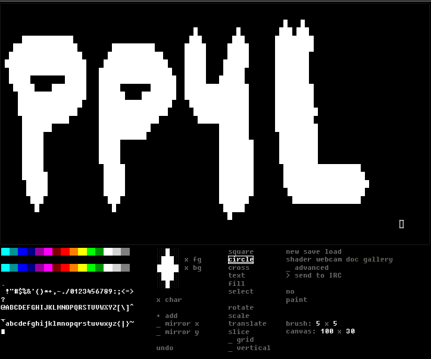

# ASCII Blaster
> web based irc art drawing tool

## Want to give it a try? Click [HERE]() to start drawing some IRC art!

### Information
This serves as a mirror of [https://asdf.us/asciiblaster/](https://asdf.us/asciiblaster/) for anyone who would like to contribute to project or fork the repository. The original creator of this does not have a Github account as far as I know.

###### Mirrors
[acid.vegas](https://git.acid.vegas/asciiblaster) • [GitHub](https://github.com/ircart/asciiblaster) • [GitLab](https://gitlab.com/ircart/asciiblaster) • [SourceHut](https://git.sr.ht/~acidvegas/asciiblaster) • [SuperNETs](https://git.supernets.org/ircart/asciiblaster)